# git讲义

## git基本介绍

git 是一种专为处理文本文件而设计的版本控制系统。程序员使用它来管理代码。

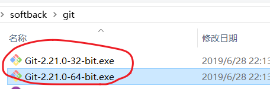

### 版本控制

[参考](https://git-scm.com/book/zh/v2/%E8%B5%B7%E6%AD%A5-%E5%85%B3%E4%BA%8E%E7%89%88%E6%9C%AC%E6%8E%A7%E5%88%B6)

> 什么是“版本控制”？版本控制是一种记录一个或若干文件内容变化，以便将来查阅特定版本修订情况的系统。 


人人都需要版本控制系统，以学生写论文为例：

- 201906011初稿.doc
- 201906013初稿-带目录.doc
- 201906016修正稿-带目录和页码.doc
- 201906018修正稿（导师二次修改）-带目录和页码.doc
- 201906020最终版.doc
- 201906022最终版（导师提了几个要求）.doc
- 201906022最终版（打死不改版）.doc
- 201906023最终版（打印店）.doc
- 201906024最终版（加上参考文献及边距）.doc


其它行业的人，只要涉及到：

- 不断更新某些个文件
- 希望记录更新的某些过程，以便可以回到这个状态

他就会需要使用版本管理软件。

>  许多人习惯用复制整个项目目录的方式来保存不同的版本，或许还会改名加上备份时间以示区别。 这么做唯一的好处就是简单，但是特别容易犯错。 有时候会混淆所在的工作目录，一不小心会写错文件或者覆盖意想外的文件。
>
> 如果这个文件可以被多个共同维护，共同修改的话，我们将会面临更大的挑战。
>
> 再如果把这个问题放在程序员的工作中：我们每天都在写代码，就是在修改某些文件，修改的频率还非常高，同时还要与其它小伙伴一起工作。想想，你要如何去管理你的代码，这是一个大问题。


### 版本管理软件

- git
  - 分布式
  - 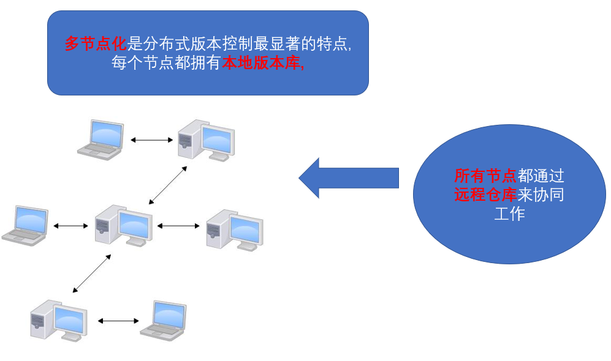
- svn
  - 集中式
  - 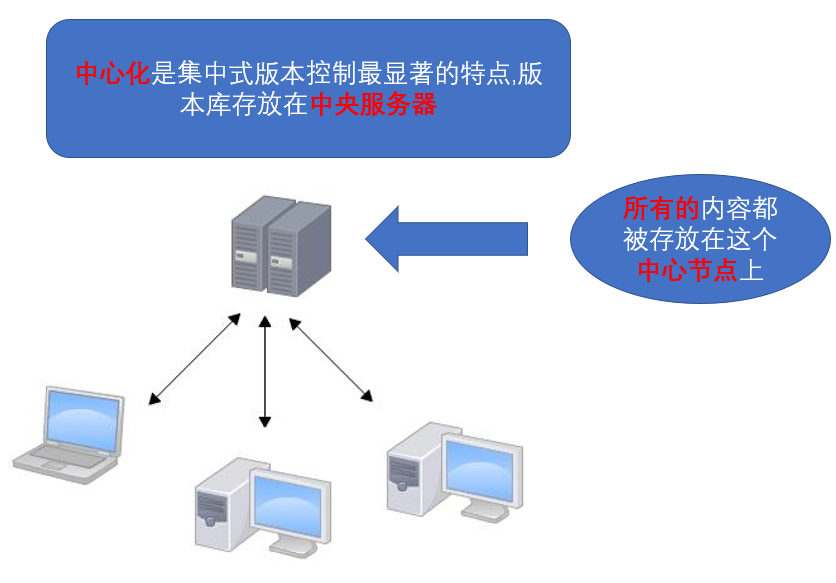

### git发展历史

> [百度百科 - 林纳斯·本纳第克特·托瓦兹]([https://baike.baidu.com/item/%E6%9E%97%E7%BA%B3%E6%96%AF%C2%B7%E6%9C%AC%E7%BA%B3%E7%AC%AC%E5%85%8B%E7%89%B9%C2%B7%E6%89%98%E7%93%A6%E5%85%B9](https://baike.baidu.com/item/林纳斯·本纳第克特·托瓦兹))


很多人都知道，Linus 在1991年创建了**开源的Linux**，从此，Linux系统不断发展，已经成为最大的服务器系统软件了。

Linus虽然创建了Linux，但Linux的壮大是靠全世界热心的志愿者参与的，这么多人在世界各地为Linux编写代码，那Linux的代码是如何管理的呢？

事实是，在2002年以前，世界各地的志愿者把源代码文件通过diff的方式发给Linus，然后由Linus本人通过手工方式合并代码！

你也许会想，为什么Linus不把Linux代码放到版本控制系统里呢？不是有CVS、SVN这些免费的版本控制系统吗？因为Linus坚定地反对CVS和SVN，这些集中式的版本控制系统不但速度慢，而且必须联网才能使用。有一些商用的版本控制系统，虽然比CVS、SVN好用，但那是付费的，和Linux的开源精神不符。

不过，到了2002年，Linux系统已经发展了十年了，代码库之大让Linus很难继续通过手工方式管理了，社区的弟兄们也对这种方式表达了强烈不满，于是Linus选择了一个商业的版本控制系统BitKeeper，BitKeeper的东家BitMover公司出于人道主义精神，授权Linux社区免费使用这个版本控制系统。

安定团结的大好局面在2005年就被打破了，原因是Linux社区牛人聚集，不免沾染了一些梁山好汉的江湖习气。开发Samba的Andrew试图破解BitKeeper的协议（这么干的其实也不只他一个），被BitMover公司发现了（监控工作做得不错！），于是BitMover公司怒了，要收回Linux社区的免费使用权。

Linus可以向BitMover公司道个歉，保证以后严格管教弟兄们，嗯，这是不可能的。实际情况是这样的：

Linus花了两周时间自己用C写了一个分布式版本控制系统，这就是Git！一个月之内，Linux系统的源码已经由Git管理了！牛是怎么定义的呢？大家可以体会一下。

Git迅速成为最流行的分布式版本控制系统，尤其是2008年，GitHub网站上线了，它为开源项目免费提供Git存储，无数开源项目开始迁移至GitHub，包括jQuery，PHP，Ruby等等。

历史就是这么偶然，如果不是当年BitMover公司威胁Linux社区，可能现在我们就没有免费而超级好用的Git了。


### 资源连接

- [Git 官网](https://git-scm.com/)
- [官方文档](<https://git-scm.com/docs>)
- [GitHub Cheat Sheet](https://github.github.com/training-kit/downloads/github-git-cheat-sheet.pdf)
- [Visual Git Cheat Sheet](http://ndpsoftware.com/git-cheatsheet.html)
- [一个国人写的Git 教程](https://www.liaoxuefeng.com/wiki/896043488029600)
- **[Pro Git](https://git-scm.com/book/zh/v2)**
- [猴子都能懂得 GIT 入门](<https://backlog.com/git-tutorial/cn/>)
- [git 简明指南](<https://rogerdudler.github.io/git-guide/index.zh.html>)

## git 下载与安装

[Git 官网](https://git-scm.com/)

直接在官网上下载安装包。双击即可安装。

验证是否安装成功：

- 在控制台中：git --version
- 鼠标右键
  - 

## git的使用方式

git是一个工具，你可以通过命令行的

- git 命令行
  - gitbash
- 图形化界面
  - tortoiseGit
  - git GUI
  - sourceTree
  - 开发工具中集成 ( vscode中就有集成的git工具 )

gitbash是基础，这个会用，其他就没有问题啦。本课的内容都是以gitbash为基础开展的。

### 启动gitbash

​	在任意目录下`右键`，在弹出的菜单中选择`gitbash`。

### gitbash 下的常用命令

与git操作无关，只是一些基础命令

```bash

# 新建目录
$ mkdir 目录1 目录2 ..

# 进入目录
$ cd 目录名

# 返回上级目录
$ cd ..

# 查看目录
$ ls 

# 查看目录及隐藏目录
$ ls -a

# 新建文件
$ touch 文件名1 文件名2 ..

# 删除文件
$ rm 文件1 文件2 ..

# 清空屏幕
$ clear

# 查看文件内容
$ cat 文件名 

# 查看文件内容 需要按q退出
$ less 文件名

#上下方向键
切换历史命令

#tab键
自动补全

# 创建并进入文件编辑模式
$ vi 文件名

	# 进入插入编辑模式 
	$ i 
	# esc退出插入编辑模式
	键盘esc
	# 退出编辑模式 但是不保存
	$ :q
	# 保存并退出编辑模式
	$ :wq
	# 强制退出但不保存编辑模式
	$ :q!
```


## 基本的 Git 工作流程

### 新建空仓库

建立一个空目录，例如d:/learngit，然后在文件夹中，点击右键，运行gitbash，并运行命令 `git init`

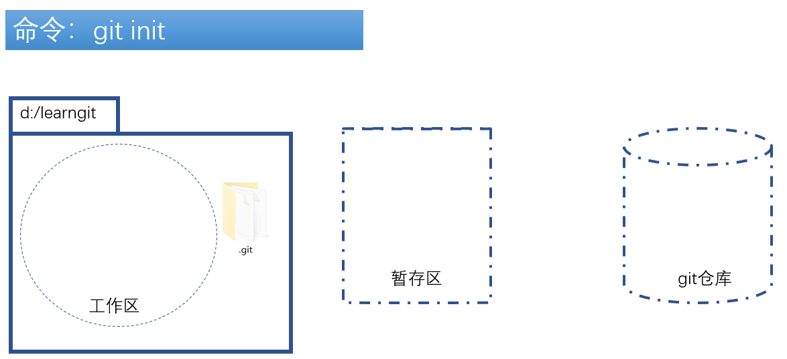

### 在工作目录中添加文件

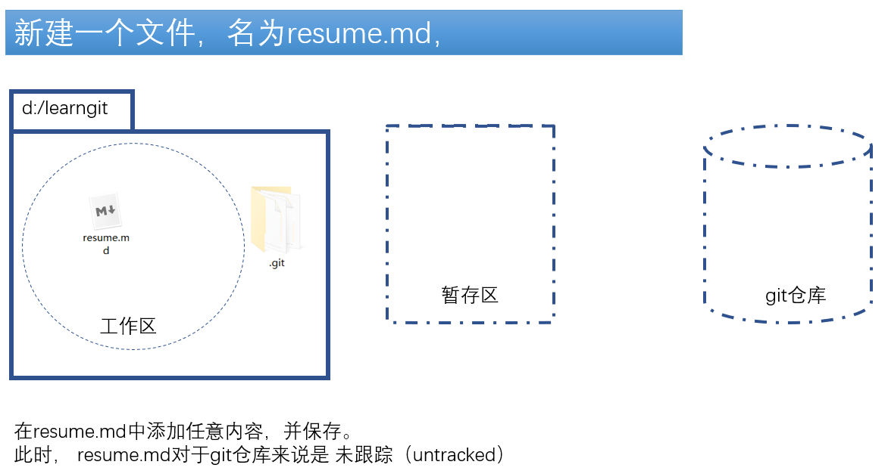

### 暂存文件

使用命令 `git add 文件名` 。将文件的本次修改放入暂存区。

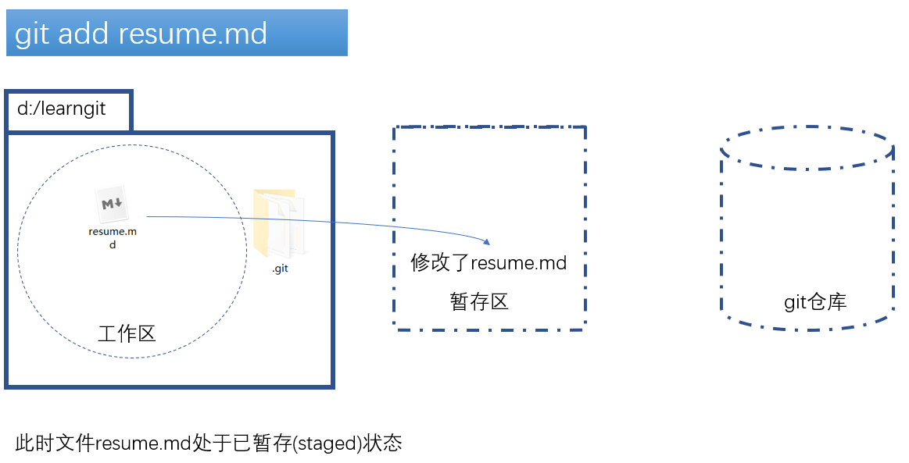

### 提交更新

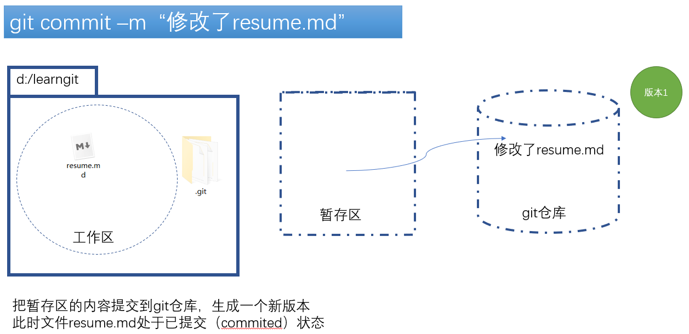

找到暂存区域的文件，将本次修改永久性存储到 Git 仓库。

#### 初次提交，要先登记 

第一次使用commit时，会需要你提供一个“身份信息”。这容易理解：我们需要记录下来本次的修改是由谁提供的，无论是论功行赏，或者是秋后算帐都需要要一个名单嘛。

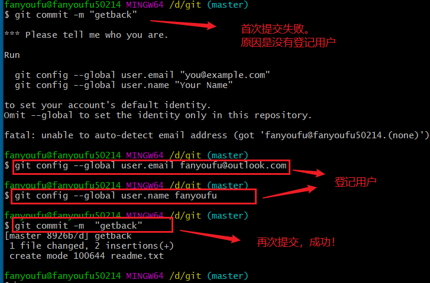

按上面的提示，进行设置用户email和name的设置之后，就可以正常使用了。要注意的是，这里的用户名和email可以是你凭空创造的（不必要与某个网站，或者真正的邮箱去对应起来），但是，为了我们后期使用方便，建议使用一个真正的邮箱地址。

命令：

```
git config --global user.email "you@example.com"
git config --global user.name "yourname"
```

当然 ，这个信息也是可以修改的，具体做法是：

1. 删除原信息

   $ git config --global --unset user.name yourname
   $ git config --global --unset user.email yourname@example.com

2. 重新设置信息。

   

### 编辑工作区的文件

使用编辑器，编辑文件。就是你在正常地做编码的工作。

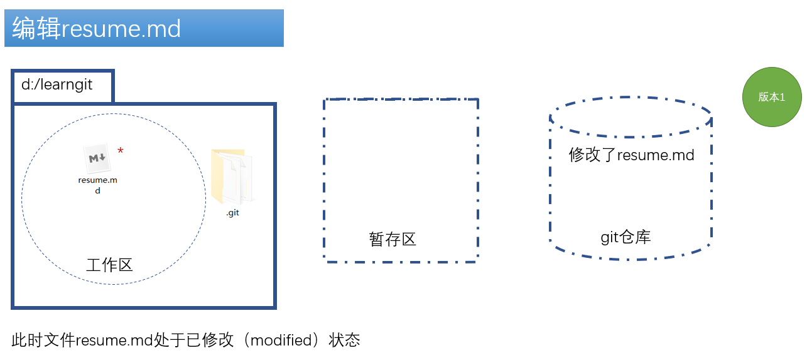


### 暂存文件

把本次修改添加到暂存区。命令是：`git add resume.md`

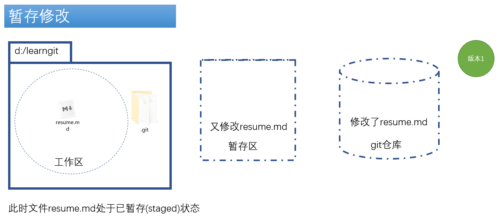

### 提交更新

再次提交更新。命令是`git commit -m "修改说明"`

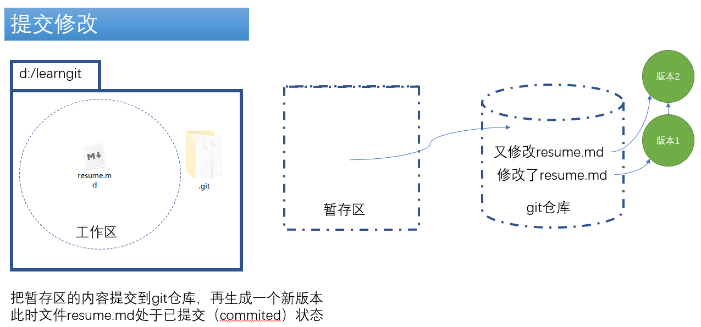


### 小结

操作

- 一次init

- 一次用户登记

- 多次add,commit

- 对一个文件的修改而言，每到了一个关键的节点，就可以向版本库中提交一次。

命令

	- git init
	- git status
	- git log
	- git add .
	- git add filename
	- git commit -m ""

## 理解工作原理

### 三个区域

- 工作区

  工作目录是对Git项目的某个版本独立提取出来的内容。 这些从 Git 仓库的压缩数据库中提取出来的文件，放在磁盘上供你使用或修改。它表现成正常的，普通的，我们日常编辑的文件。

- 暂存区（stage）

  暂存区是一个文件，保存了下次将提交的文件列表信息。

- Git 仓库

  记录我们所有的操作记录，它具体会以分支的模式呈现出来。

  

### 文件的四种状态

通过`git status` 命令来查看状态。

工作目录下的每一个文件会处于这两种状态：已跟踪或未跟踪。 已跟踪的文件是指那些被纳入了版本控制的文件，在上一次快照中有它们的记录，在工作一段时间后，它们的状态可能处于未修改，已修改或已放入暂存区。 工作目录中除已跟踪文件以外的所有其它文件都属于未跟踪文件，它们既不存在于上次快照的记录中，也没有放入暂存区。 初次克隆某个仓库的时候，工作目录中的所有文件都属于已跟踪文件，并处于未修改状态。

- 未跟踪（untracked）

  没有纳入版本控制的文件。你可以通过 `git add` 把他们加入Git的监控中。

- 已跟踪

  指那些被纳入了版本控制的文件

  - 已修改（modified）

    表示修改了文件，但还没保存到 Git 仓库中。 对于已经被跟踪的文件，作了修改但还没有放到暂存区域，就是已修改状态。（要与普通文件的操作区分开：你在编辑器中编辑文件时，文件处于正在编辑，如果按下ctrl+s表示已经保存）

  - 已暂存（staged）。

    表示对一个已修改文件的当前版本做了标记，使之包含在下次提交的信息中。如果作了修改并已放入暂存区域，就属于已暂存状态。 

  - 已提交（committed）

    表示数据已经安全的保存在本地Git仓库中。或者是Git 目录中保存着特定版本的文件。

    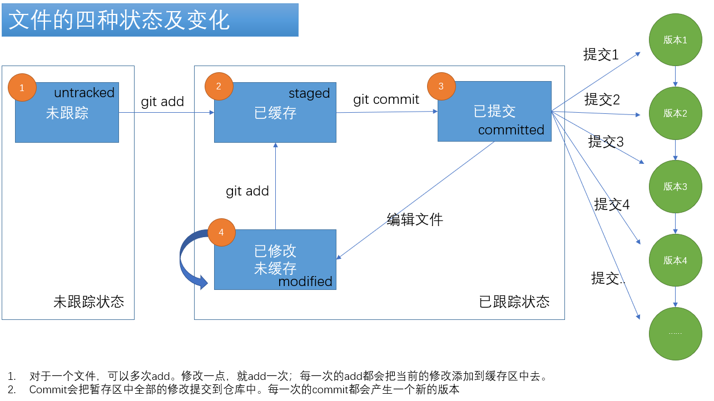


## 撤销修改

Git的工作原理是跟踪文件的修改，我们所做的一切操作：新增，删除，修改，重命名等等都是修改。

在现实生活中，我们没有后悔药可以吃，但在实现的开发过程中，git给我们提供了几种不同功能的后悔药，它的能力要远远强大于我们经常使用的ctrl+z。


### 放弃工作区的修改

> 场景：今天来上班，丢了一只鞋，心情很不好。
>
> 开机写代码，动了10个文件，改的一头雾水。没有进展，还不如不修改。

文件处于已修改状态，并没有提交到暂存区（即没有运行add）。当然，如果你只是少量的修改代码的话，直接在编辑器中ctrl+z就可以了。但是，如果你修改了很多文件，或者一个文件的修改已经不能通过ctrl+z来还原了，此时，你就可以使用命令：

```bash
#放弃指定文件的修改
git checkout -- yourfilename.ext
#放弃所有文件的修改
git checkout .
```

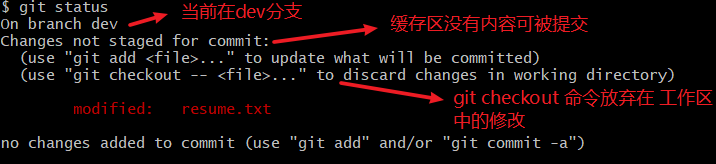

### 放弃暂存区的修改

> 背景:改了很多代码了，也add了(添加到了暂存区)，又后悔了。

已经运行了add,文件处于已暂存状态。但没有commit。

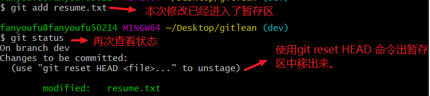

两条命令：

```
# 对单个文件
git reset HEAD yourfilename.ext  
git checkout -- yourfilename.ext

# 对所有
git reset HEAD 
git checkout .
```


### 从仓库恢复

你已经commit了本次修改，代码也交到了仓库中。但是，又后悔了。

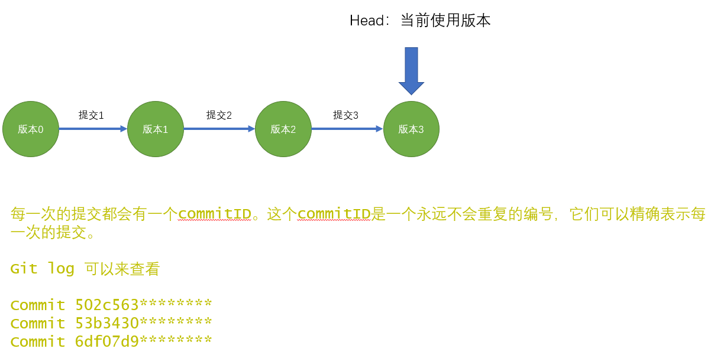

此时你有两种选择： 

- 回滚整体版本

```
git reset --hard commitID
```

- 恢复某一个文件

```
git checkout commitID yourfilename
```

commitID就是每次提交的编号。


## 分支管理

### 使用分支的场景 

现在整个项目处于正常运行的期间，我们只需要进行运维工作就可以了，老大说可以进行小面积的代码重构工作。那你如何保证在不影响现有的代码的情况下，去进行代码重构工作？ 

> 常规方式：整个项目复制出来一份，然后在此基础上进行操作。这种方法是不可行的，你想一想，一旦你完成了重构工作，如何把这个复制出来的项目与原项目进行整合呢？


正确是使用git中的分支。

> 分支可以理解为平行宇宙：在一个宇宙中你是万人瞩目的世界领袖，而另一个宇宙中，你是深陷监牢的大毒枭。你们相互不干扰。

其实，我们一开始使用git就已经处在在分支的概念中了：

- 在每次提交时，能观察到的一个关键字master

### 分支的基本操作

以代码优化为例。对之前的代码进行优化，同时保证老代码能工作。

- 创建新分支

  进行：文件修改，新建文件

- 切换分支

- 合并分支

```bash
# 新建一个分支
$ git branch <分支名称>

# 切换到指定分支
$ git checkout <分支名称>

# 新建分支并切换到该分支
$ git checkout -b <分支名称>

#删除分支 
$ git branch -d <分支名称>

# 列出所有本地分支
$ git branch 

# 列出所有远程分支
$ git branch -a
# 新建一个分支，指向指定commit
$ git branch [branch] [commit]
```


### 分支的工作原理

图示。

如下两个命令可以图形化查看git commit的过程

- git log --graph

- gitk

### 合并分支

格式：`git merge 分支名`

把指定的分支名中的代码合并到**当前的分支**上来。


### 分支中的冲突

一般情况下，git会自动帮我们去合并分支，而不会产生冲突。但有些意外的情况，它无法帮助我们合并。一个典型的会产生冲突的场景是：

（1）a分支修改文件1并commit

（2）b分支也修改文件1并commit。

（3）恰好这两个修改`都是修改了同一个地方`（例如：都是修改了某个函数的函数名），则此时，就会出现冲突了。

解决冲突的基本步骤：

1. 打开有冲突的文件。

2. 根据实际情况手动修改（注意去掉冲突时自动加入的特殊符号）

3. 保存修改，并提交

   git commit -a -m ""


### 使用分支的基本流程

在项目开发过程中，我们至少会接触三个分支：

- 名为master的主分支

  master分支表示稳定的，可以正常运行的主分支。在我们初始化git时，它就会自动被创建。代码上线，一般会master上的代码。

- 名为dev的开发分支

  开发中，我们一般会新建一个名为 dev的分支(dev是development的简写，表示开发)，在这个基础上进行开发，测试，然后**合并到master分支**上。当然了，名字也不一定必须是dev。

- 名为bug的临时分支。

  在项目上线运行之后，用户报出bug时，我们一般会拉出一个新的分支来解决这个bug。 我们假设出bug时一般会附一个bug编号，如1034，此时，我们要去修改代码以解决这个bug，应该怎么做呢？

  ```bash
  // 当前你正在dev分支开发
  
  // 从目前分支回到master分支。
  git checkout master
  // 在master分支上拉出新分支,分支名中包含了bug及bug的编号
  git checkout -b bug1034
  // 修改代码，修复bug。希望你可以很顺利地解决这个bug
  // 解决bug之后，回到master分支
  git checkout master
  // 在master分支上合并bug1034分支
  git merge bug1034
  // 准备再次上线 ...
  // 你也可以选择删除这个bug分支
  git branch -d bug1034
  //  回到dev分支，继续开发（搬砖）
  git checkout dev
  ```


1. 保存目前手头上在dev分支上的修改

    1. git stash
    2. 或者是git commit

2. 切换到master分支

   - git checkout master

3. 在master分支上拉出新分支，一般的命令是bug加编号。如bug1034。

    - git checkout -b but1034

4. 在bug1034分支上进行编码，以修改这个bug。修复完成之后，合并到master分支：

   - git checkout master
   - git merge bug1034

5. 确认无误之后，回到dev分支 ，继续开发

    - git checkout dev

    - 如果之前有git stash，则通过git stash pop恢复

      

### 分支命令小结

- 查看分支 

  `git branch`命令会列出所有分支，当前分支前面会标一个`*`号

- 创建分支

  git branch 分支名

- 切换分支

  git checkout 分支名

- 创建并切换

  git checkout -b 分支名

- 合并分支

  git merge 分支名

  把指定的分支名中的代码合并到当前的分支上来。

- 解决冲突

  一般情况下，git会自动帮我们去合并，但有些意外的情况，它无法帮助我们合并，这里就会产生冲突。一个典型的会产生冲突的场景:是a分支修改并commit了文件1,b分支也修改并commit了文件1，恰好这两个修改都是修改了同一个地方（例如：都是修改了某个函数的函数名），则此时，就会出现冲突了。

- 删除分支

  git branch -d 分支名

  如果你在某分支下已经新加入了很多文件，删除分支并不会删除这些文件


## 远程仓库github

### git和github的关系

git是一个版本管理工具，github提供了一个`网络版本`的代码库，它可以允许你在远程建立git库，这样你就不用担心本地电脑坏掉啦。

假设你已经先在github上申请帐号（它会向你的邮箱发验证码，提醒：你的邮箱可能会把它当作一个垃圾邮件）。接下来，我们看看我们目前的处境：

- 有一个可以建立远程库的github帐号

- 有一个本地使用的版本管理工具git。

下面我们就来介绍一下如何把它们关联起来。


### 把别人的代码下载下来

1. 复制地址。
2. 运行命令：`git clone 地址`

### 建立自己的代码仓库

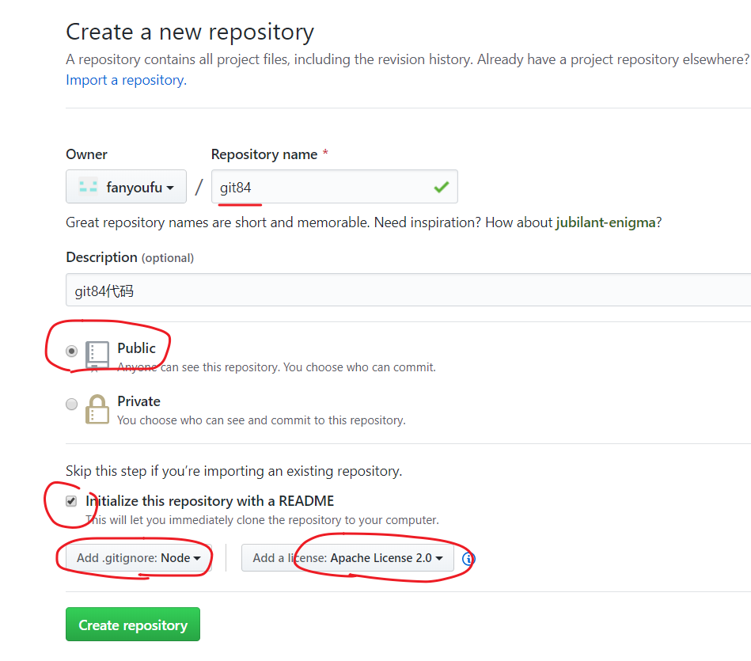

先创建远程仓库，再克隆到本地

1. 登陆github，创建仓库

2. 在电脑的某个文件夹下，通过git clone到本地。

   - git clone命令会自动创建一个文件夹，文件夹名就是项目名
   - git clone命令只需要在第一次时使用

3. 本地正常编辑（修改代码，新建文件等等），提交到本地仓库。

   1. git add .
   2. git commit

4. 推送到远程github

   git push 


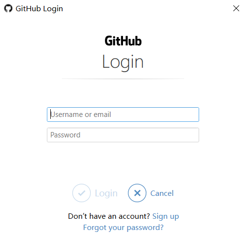


github的补充操作

1. 删除仓库
2. 直接进行代码编辑

### 多端同步


基本操作流程：

1. 在github（或者是公司自己的代码库）上建立仓库

2. 在A电脑上：使用https协议，通过git clone到本地。

   - clone命令会创建一个文件夹
   - clone命令只需要在第一次时使用

3. 在A电脑上：正常本地编辑（修改代码，新建文件等等），提交到本地仓库。

   1. git add .
   2. git commit

4. 在A电脑上：把本地仓库同步到远程github

   git push

5. 在B电脑上：git clone 到本地

6. 拉取：git pull 

   git pull  是从远程拉取最新的代码。（可能在你在本地修改代码时，有另外的同事也在修改代码，所以在提交之间一定要先拉取最新的代码）


## 其他（了解）

### 打标

Git 可以给历史中的某一个提交打上标签，以示重要。 比较有代表性的是人们会使用这个功能来标记发布结点（v1.0 等等）。

在 Git 中列出已有的标签是非常简单直观的。 只需要输入 `git tag`：

> ```bash
> $ git tag
> v0.1
> v1.3
> ```

> ```bash
> # 列出所有tag
> $ git tag
> 
> # 新建一个tag在当前commit
> $ git tag [tag]
> 
> # 新建一个tag在指定commit
> $ git tag [tag] [commit]
> 
> # 删除本地tag
> $ git tag -d [tag]
> 
> # 删除远程tag
> $ git push origin :refs/tags/[tagName]
> 
> # 查看tag信息
> $ git show [tag]
> 
> # 提交指定tag
> $ git push [remote] [tag]
> 
> # 提交所有tag
> $ git push [remote] --tags
> 
> # 新建一个分支，指向某个tag
> $ git checkout -b [branch] [tag]
> ```
>
> **`任务`**:  
>
> 1. 给自己的第一次提交版本打上标签 v1.0.0
> 2. 给自己的第三次提交打上标签 v.1.0.1
> 3. 分别查看以上两个标签内容信息
>
> **`路径`**
>
> ```bash
> # 打标签
> $  git  tag v1.0.0 <commitid>
> $  git  tag v1.0.1 <commitid>
> # 查看标签
> $ git show v.1.0.0
> $ git show v.1.0.1
> ```


### 忽略文件.gitignore

`目标`:知道什么是忽略文件, 并在git中应用 

- 忽略文件是用来存放git工作区中 被**默认不追踪**的文件信息
- 例如 npm依赖目录 node_modules

**`任务`** :新建一个忽略文件,在git中忽略掉所有的js文件 和 node_modules 

**`路径`**

1. 初始化仓库
2. 新建.gitignore
3. 写入以下配置信息

```bash 
*.js
node_modules
```

注意：

如果一个文件已经在git仓库中跟踪了，则必须先从跟踪状态中移除。`git rm --cached 文件名`

### 先有本地代码库，再关联到远程github

如果你先在本地建立了git库，想关联到远程github。你应该这样做：

1. 去github上建立一个与本地代码库同名的代码库。
2. 使用如下命令：

`git remote add origin https://github.com/fanyoufu/04-git.git`

`git push -u origin master`

把本地库的内容推送到远程，用`git push`命令，实际上是把当前分支`master`推送到远程。

由于远程库是空的，我们第一次推送`master`分支时，加上了`-u`参数，Git不但会把本地的`master`分支内容推送的远程新的`master`分支，还会把本地的`master`分支和远程的`master`分支关联起来，在以后的推送或者拉取时就可以简化命令。

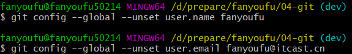


你也可以git commit -a -m "提交说明" 来代替上面两句代码了。


### 恢复某一个文件

背景：每次提交都修改了多个文件。每次提交都会有一个版本号。 

目标：对某一个文件，希望回到某一个版本号，还原这个文件。

方法一：要用到如下三条命令

```
git reset commitID yourfilename.txt
git commit -m ""
git checkout yourfilename.txt
```

方法二：

```javascript
git checkout commitID yourfilename
```


### 关于commit内容的说明

在开发过程，不要过于频繁地提交代码，而应该是在完成某个功能开发之后，再去提交，并且对于commit的内容也应该遵循固定的格式和规范。我们可以使用'commitizen'来帮助我们去写commit

```
npm install -g commitizen
```

```javascript
commitizen init cz-conventional-changelog --save-dev --save-exact
```


### 资源链接

- [Git 官网](https://git-scm.com/)

- [官方文档](<https://git-scm.com/docs>)

- [GitHub Cheat Sheet](https://github.github.com/training-kit/downloads/github-git-cheat-sheet.pdf)

- [Visual Git Cheat Sheet](http://ndpsoftware.com/git-cheatsheet.html)

- [一个国人写的Git 教程](https://www.liaoxuefeng.com/wiki/896043488029600)

- **[Pro Git](https://git-scm.com/book/zh/v2)**

- [猴子都能懂得 GIT 入门](<https://backlog.com/git-tutorial/cn/>)

- [git游戏](https://learngitbranching.js.org)

  


### 名词解释

Git 是一个可安装应用，它允许你对你自己所做的更改进行注释，用以创建易于导航的系统历史。

- **Version Control（版本控制）:** 任何一个能够让你了解文件的历史，以及该文件的发展进程的系统。
- **Git：**一个版本控制程序，通过对变更进行注释，以创建一个易于遍历的系统历史。
- **Commit（提交）：**在指定时间点对系统差异进行的注释 “快照”。
- **Local（本地）：**指任意时刻工作时正在使用的电脑。
- **Remote（远程）：** 指某个联网的位置。
- **Repository (仓库，简称 repo)：**配置了Git超级权限的特定文件夹，包含了你的项目或系统相关的所有文件。
- **Github：**获取本地提交历史记录，并进行远程存储，以便你可以从任何计算机访问这些记录。
- **Push（推送）：**取得本地Git提交（以及相关的所有工作），然后将其上传到在线Github。
- **Pull（拉取）：**从在线的Github上获取最新的提交记录，然后合并到本地电脑上。
- **Master (branch)：主分支，**提交历史 “树”的 “树干”，包含所有已审核的内容/代码。
- **Feature branch（功能分支/特性分支）：**一个基于主分支的独立的位置，在再次并入到主分支之前，你可以在这里安全地写工作中的新任务。
- **Pull Request（发布请求）：**一个 Github 工具，允许用户轻松地查看某功能分支的更改 （the difference或 “diff”），同时允许用户在该分支合并到主分支之前对其进行讨论和调整。
- **Merge（合并）：**该操作**指**获取功能分支的提交，加入到主分支提交历史的顶部。
- **Check out（切换）：**该操作指从一个分支切换到另一个分支。

